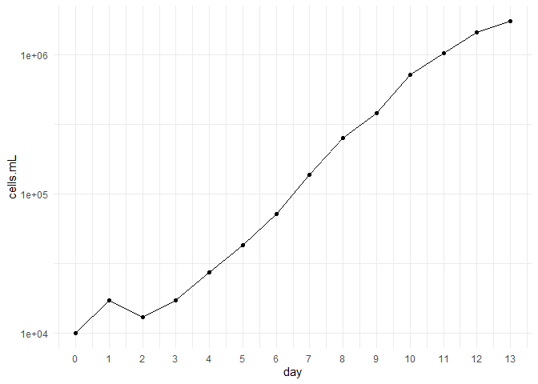

Homework 4
================
Katelyn

## HMK_4

Create your own graph, that is not a scatterplot. This is a growth curve
for a lab culture that ran for just under two weeks.

``` r
library(tidyverse)

syn <- read.csv("hmk4.csv")

ggplot(syn, aes(x = day, y = cells.mL)) +
  geom_point() +
  geom_line() +
  scale_y_continuous(trans='log10') +
  scale_x_continuous(breaks = seq(0, 13, 1)) +
  theme_minimal() 
```


