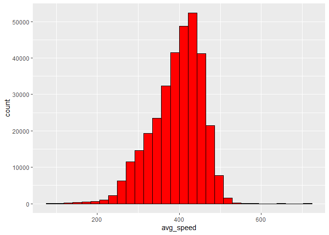

Hmk_05
================
Katelyn

Please read the entire [R for Data
Science](https://r4ds.had.co.nz/transform.html) before you do this
homework.

This homework relies on the `nycflights13` package, which contains
several data frames, including `airlines`, `airports`, `flights`,
`planes`, and `weather`. Loading `nycflights13` puts all of these data
frames on the search path, so that they are available automatically,
just like `mpg` or `mtcars`.

## Installing data packages

Remember that any package needs to be installed only once (per version
of R), but needs to be loaded every time we start a new R session.

To install `nyclflights13`, we use `install.packages("nycflights13")`
(with quotation marks). To load it, we use `library(nycflights13)`.

``` r
library(nycflights13)
library(tidyverse)
?flights
?nycflights13
```

# Question 1: filtering

Make a plot of air time (Y) as a function of distance (X) for all
flights that meet the following criteria:

-   originate from LaGuardia airport (“LGA”)
-   departed on the 16th of the month
-   have a flight distance of less than 2000

``` r
q1 <- filter(flights, origin == "LGA", day == 16, distance < 2000)

ggplot(q1, aes(x = distance, y = air_time)) +
  geom_point()
```


# Question 2: dealing with NAs

Make a data frame of all of the rows of `flights` that have values for
*both* `arr_time` and `dep_time` - that is, neither of those values are
`NA`.

``` r
q2 <- filter(flights, arr_time > 0, dep_time > 0)
```

## filtering NAs

`ggplot()` will automatically remove NA values from the plot, as you may
have seen in question 1, but it emits a warning message about that. Of
course you could silence the warning message using [chunk
options](https://bookdown.org/yihui/rmarkdown-cookbook/chunk-options.html),
but how could you prevent them from appearing in the first place?

`q1 %>% drop_na() #where q1 is the dataframe we want to clean up`

# Question 3: adding columns

Create a data frame of average flight speeds, based on `air_time` and
`distance`. Make either a histogram or a density plot of the data. If
you like, you may break the data out (e.g. by airline, or some other
variable) in a way that you think makes sense.

``` r
q3 <- flights %>%
  mutate(avg_speed = 60*(distance / air_time))

ggplot(data = q3, aes(x = avg_speed)) +
  geom_histogram(color = "black", fill = "red")
```


