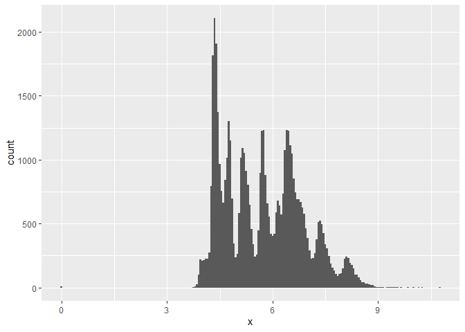
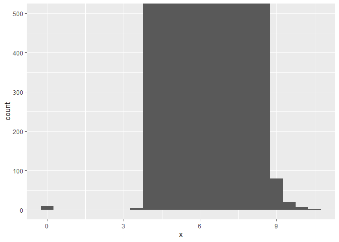
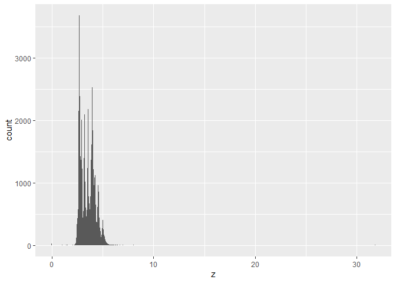
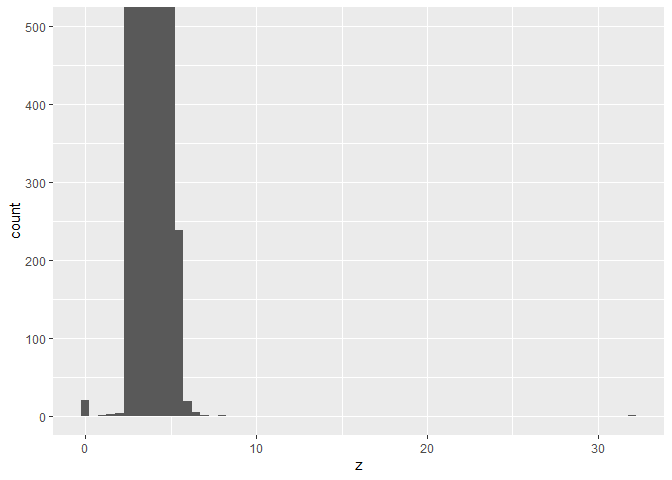
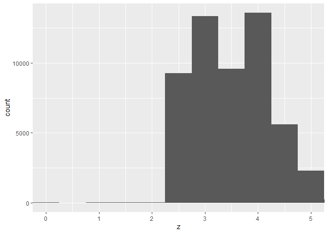
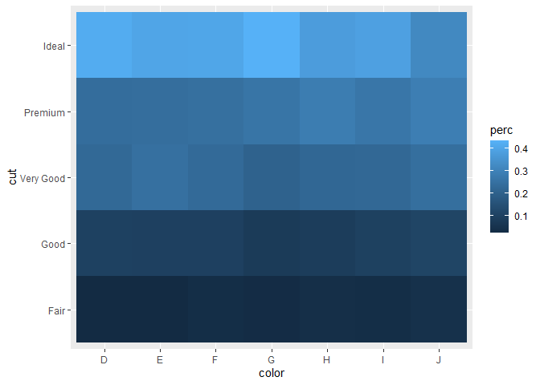
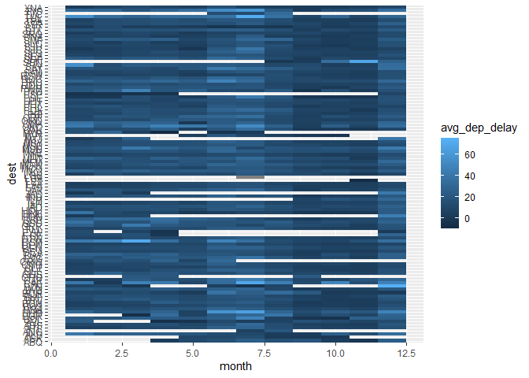
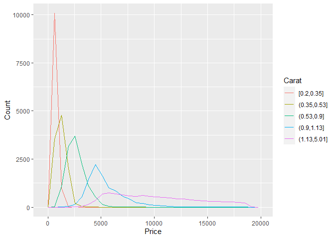
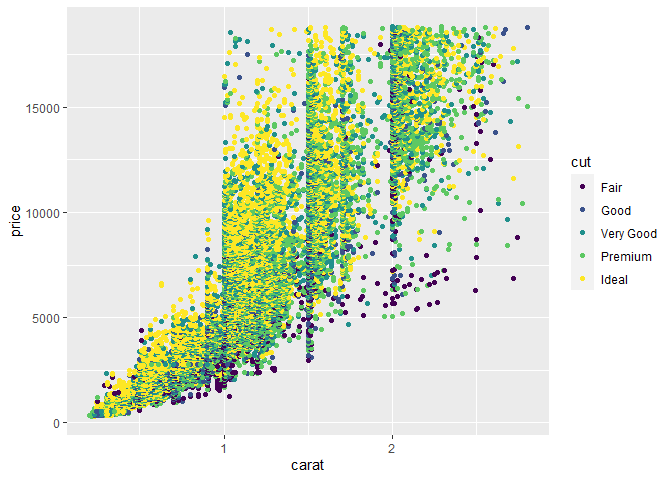

Homework 6
================
Katelyn

1.  **Question 1**: In the `diamonds` dataset, some of the values are
    almost certainly bad (although it is not possible to be 100% sure
    which ones are bad and which are valid).

    -   **1.1** Identify data that seem bad.

    -   **1.2** Explain why you think they are bad.

    -   **1.3** Create a data frame with bad data excluded.

``` r
library(tidyverse)

# X - plotting to see distribution 
ggplot(diamonds) + 
  geom_histogram(mapping = aes(x = x), binwidth = 0.05)
```



``` r
# lets zoom in to see since the Y axis scale is  
# so large 
ggplot(diamonds) + 
  geom_histogram(mapping = aes(x = x), binwidth = 0.5) +
  coord_cartesian(ylim = c(0, 500))
```



``` r
# looks like there may be an outlier that is less # than 3 & a small tail greater than 9, lets look 
Xunusual <- diamonds %>% 
  filter(x < 3 | x > 9) %>%
  select(price, x, y, z) %>%
  arrange(x)

# Z - plotting to see distribution 
ggplot(diamonds) + 
  geom_histogram(mapping = aes(x = z), binwidth = 0.05)
```



``` r
# lets zoom in to see since the Y axis scale is so
# large 
ggplot(diamonds) + 
  geom_histogram(mapping = aes(x = z), binwidth = 0.5) +
  coord_cartesian(ylim = c(0, 500))
```



``` r
# looks like there may be an outlier that is 
# greater than 30,but I can't tell the numbering
# for the outlier close to 0

ggplot(diamonds) + 
  geom_histogram(mapping = aes(x = z), binwidth = 0.5) +
  coord_cartesian(xlim = c(0, 5))
```



``` r
# looks like the other outlier is less than one

Zunusual <- diamonds %>% 
  filter(z < 1 | z > 30) %>%
  select(price, x, y, z) %>%
  arrange(z)
```

**Question 1.1 & 1.2: Answer**

It looks like the data that are bad, seem to be when the x, y, and z
factors are either 0 or way too large to be real. Since all of these
factors are a measurement of the diamond in mm there is no way they can
be zero.

**Question 1.3: Answer**

From our exploration above, it looks like we can remove a few data
points. Y less than 3, greater than 20. X less than 3. Z less than one,
greater than 30. Since there are two options here: remove the entire row
(not recommended) OR use mutate to replace unusual values with NA.

``` r
diamonds2 <- diamonds %>% 
  mutate(y = ifelse(y < 3 | y > 20, NA, y))
diamonds3 <- diamonds2 %>% 
  mutate(x = ifelse(x < 2, NA, x))
diamonds.clean <- diamonds3 %>% 
  mutate(y = ifelse(x < 3 | y > 30, NA, z))

summary(diamonds.clean)
```

         carat               cut        color        clarity          depth      
     Min.   :0.2000   Fair     : 1610   D: 6775   SI1    :13065   Min.   :43.00  
     1st Qu.:0.4000   Good     : 4906   E: 9797   VS2    :12258   1st Qu.:61.00  
     Median :0.7000   Very Good:12082   F: 9542   SI2    : 9194   Median :61.80  
     Mean   :0.7979   Premium  :13791   G:11292   VS1    : 8171   Mean   :61.75  
     3rd Qu.:1.0400   Ideal    :21551   H: 8304   VVS2   : 5066   3rd Qu.:62.50  
     Max.   :5.0100                     I: 5422   VVS1   : 3655   Max.   :79.00  
                                        J: 2808   (Other): 2531                  
         table           price             x                y         
     Min.   :43.00   Min.   :  326   Min.   : 3.730   Min.   : 0.000  
     1st Qu.:56.00   1st Qu.:  950   1st Qu.: 4.710   1st Qu.: 2.910  
     Median :57.00   Median : 2401   Median : 5.700   Median : 3.530  
     Mean   :57.46   Mean   : 3933   Mean   : 5.732   Mean   : 3.539  
     3rd Qu.:59.00   3rd Qu.: 5324   3rd Qu.: 6.540   3rd Qu.: 4.040  
     Max.   :95.00   Max.   :18823   Max.   :10.740   Max.   :31.800  
                                     NA's   :8        NA's   :10      
           z         
     Min.   : 0.000  
     1st Qu.: 2.910  
     Median : 3.530  
     Mean   : 3.539  
     3rd Qu.: 4.040  
     Max.   :31.800  
                     

2.  **Questions 2-4**: Do three more exercises from Chapter 7 of your
    choice. Be sure to state the full question (most “exercises” have a
    few questions embedded in them. One of the exercises you choose
    should be from section 7.5.3.1.

**Exercise 7.4.1**

1.  What happens to missing values in a histogram? What happens to
    missing values in a bar chart? Why is there a difference?

    **Answer**: Histogram: NA are ignored and not included. Barchart
    will make a NA category.

2.  What does na.rm = TRUE do in mean() and sum()?

    **Answer**: na.rm = TRUE generally suppresses warnings that tell you
    missing values have not been plotted.

**Exercise 7.5.2.1**

1.  How could you rescale the count dataset above to more clearly show
    the distribution of cut within color, or color within cut?

    **Answer**:mutate it as a percent

    ``` r
      diamonds %>%
      count(color, cut) %>%
      group_by(color) %>%
      mutate(perc = n / sum(n)) %>%
      ggplot(aes(color, cut, fill = perc)) +
      geom_tile()
    ```

    

2.  Use geom_tile() together with dplyr to explore how average flight
    delays var by destination and month of year. What makes the plot
    difficult to read? How could you improve it?

    **Answer:** the destinations are vary close together, making it hard
    to interpret the plot. Also the colors don’t trasnlate the delay
    time well in my head. The only way I can thnk to improve it, would
    be to use small multiples, since there is SO much data here, the
    tiles make it hard for me to see all the data in a meaninful way.

``` r
nycflights13::flights %>% group_by(dest, month) %>%
  summarize(avg_dep_delay = mean(dep_delay, na.rm = TRUE)) %>%
  ggplot() +
  geom_tile(mapping = aes(x = month, y = dest, fill = avg_dep_delay))
```



3.  Why is it slightly better to use aes(x = color, y = cut) rather than
    the alternative, in the example above?

    **Answer**: they are both categorical and neither are dependant on
    one another, so nothing specific to the interpretation of the data.
    I think it is just preference to how you want to view it and
    potentially labels on the X axis running together if they are too
    long.

**Exercise 7.5.3.1**

1.  Instead of summarizing the conditional distribution with a boxplot,
    you could use a frequency ploygon. What do you need to consider when
    using cut_width() vs cut_number()? How does that impact a
    visualization of the 2d distribution of carat and price?

    **Answer**: cut_width() divides x into bins of specified width (can
    have different number of observations in each) while cut_number()
    divides x by the same number of points in each bin. You will need to
    take this into account when interpreting the plot, since it may be
    hard to see relationships if boxplots look roughly the same
    regardless of how many observations there are per bin.

    **Answer**: I could not get the freqpoly to work with price as the
    Y, I kept getting the error that I cannot specify a Y for this geom.
    So I did just carrot and the cut_number only produced one line along
    the graph, while the cut_width produced several lines.

2.  Visualize the distribution of carat, partitioned by price.

``` r
smaller <- diamonds %>% 
  filter(carat < 3) 

ggplot(data = smaller, mapping = aes(x = carat, y = price)) + 
  geom_boxplot(mapping = aes(group = cut_width(carat, 0.1)))
```



3.  How does the price distribution of very large diamonds compare to
    small diamonds? It is as you expect, or does it surprise you?

**Answer:** It looks like the larger diamonds have less variability in
price. The smaller diamonds look like they go up in price very quickly
for very small additions to size, and then once you get to the larger
diamonds (i.e. \~2 carats) it seems you pay the same for range of sizes
around the 2 carats. This is very suprising. Its like the price per
ounce or size of diamonds goes down the bigger your rock gets.

4.  Combine two of the techniques you’ve learned to visualize the
    combined distribution of cut, carat, and price.

``` r
ggplot(data = smaller, mapping = aes(x = carat, y = price)) + 
  geom_point(mapping = aes(color = cut))
```



5.  Two dim plots reveal outliers that are not visible in one dim plots,
    some points in the plot have an unusual combination of x and y
    values, which makes the points outliers even though their x and y
    values appear normal when examined separately.Why is scatter plot a
    better display than a binned plot for this case?

**Answer:** The outliers are difficult to see in the bins because the
bins are assessing a relationship between the variables. The Scatterplot
is helping us visualize the relationship, thus spotting the outliers.
