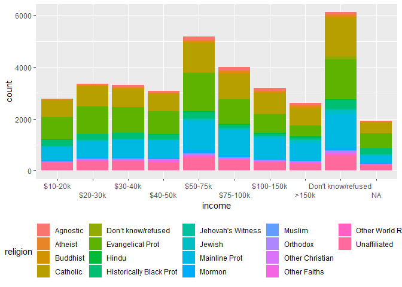

Homework 8: summarising, reshaping, merging
================
Katelyn

# Q1: Summarizing operations and exploratory data analysis

## Q1a

Download `experiment1.csv` from Canvas (under files). This reports two
variables from an experiment that has four treatments. Creatively, the
treatments are `1`, `2`, `3`, and `4`, and the two variables are `x` and
`y`.

Create a data frame that contains the mean, standard deviation, and
number of points for each treatment. You will want to use functions like
`summarise()`, `group_by()`, `mean()`, and `sd()`.

``` r
library(tidyverse)

E1.DF <- read.csv("experiment1.csv")

view(E1.DF)

E1.DF.MX <- 
  E1.DF %>% group_by(balls) %>% summarise(mean_balls_x = mean(x)) 

E1.DF.MY <- 
  E1.DF %>% group_by(balls) %>% summarise(mean_balls_y = mean(y)) 

E1.DF.M <- inner_join(E1.DF.MX, E1.DF.MY, by="balls")

E1.DF.SDX <-
  E1.DF %>% group_by(balls) %>% summarise(sd_balls_x = sd(x))

E1.DF.SDY <-
  E1.DF %>% group_by(balls) %>% summarise(sd_balls_y = sd(y))

E1.DF.SD <- inner_join(E1.DF.SDX, E1.DF.SDY, by="balls")

E1.DF.N <-
  E1.DF %>% group_by(balls) %>% count(balls)


E1.DF.Join1 <- inner_join(E1.DF.M, E1.DF.SD, by="balls")

E1.DF.Final <- inner_join(E1.DF.Join1, E1.DF.N, by="balls")                                      

head(E1.DF.Final)
```

    # A tibble: 4 × 6
      balls mean_balls_x mean_balls_y sd_balls_x sd_balls_y     n
      <int>        <dbl>        <dbl>      <dbl>      <dbl> <int>
    1     1            9         7.50       3.32       2.03    11
    2     2            9         7.50       3.32       2.03    11
    3     3            9         7.5        3.32       2.03    11
    4     4            9         7.50       3.32       2.03    11

Are the data sets different in any important way?

**Answer**: It does look like the X balls have a different mean of 9
while the y balls have a mean around 7.5 Additionally, the SD of X balls
is 3.31 and Y balls is around 2.03

## Q1b

Now load the file `experiment2.csv`. Again, this describes two variables
for multiple treatments (here called `dataset`). Answer the same
questions as above.

``` r
library(tidyverse)

E2.DF <- read.csv("experiment2.csv")
view(E1.DF)

E2.DF.MX <- 
  E2.DF %>% group_by(dataset) %>% summarise(mean_dataset_x = mean(x)) 

E2.DF.MY <-     
  E2.DF %>% group_by(dataset) %>% summarise(mean_dataset_y = mean(y)) 

E2.DF.M <- inner_join(E2.DF.MX, E2.DF.MY, by="dataset")

E2.DF.SDX <-
  E2.DF %>% group_by(dataset) %>% summarise(sd_dataset_x = sd(x))

E2.DF.SDY <-
  E2.DF %>% group_by(dataset) %>% summarise(sd_dataset_y = sd(y))

E2.DF.SD <- inner_join(E2.DF.SDX, E2.DF.SDY, by="dataset")

E2.DF.N <-
  E2.DF %>% group_by(dataset) %>% count(dataset)


E2.DF.Join1 <- inner_join(E2.DF.M, E2.DF.SD, by="dataset")

E2.DF.Final <- inner_join(E2.DF.Join1, E2.DF.N, by="dataset")                                      

head(E2.DF.Final)
```

    # A tibble: 6 × 6
      dataset  mean_dataset_x mean_dataset_y sd_dataset_x sd_dataset_y     n
      <chr>             <dbl>          <dbl>        <dbl>        <dbl> <int>
    1 away               54.3           47.8         16.8         26.9   142
    2 bullseye           54.3           47.8         16.8         26.9   142
    3 circle             54.3           47.8         16.8         26.9   142
    4 dino               54.3           47.8         16.8         26.9   142
    5 dots               54.3           47.8         16.8         26.9   142
    6 h_lines            54.3           47.8         16.8         26.9   142

Are the data sets different in any important way?

**Answer**: Looks like all the data have the same mean and sd.
Interesting.

# Q2: pivoting

Create a plot that illustrates the differences in income among
religions, using the `relig_income` data set that is built into
tidyverse.

You will need to create a tidy data frame to do this.

``` r
library(tidyverse)

relig_income_long <- relig_income %>% 
  pivot_longer(!religion, names_to = "income", values_to = "count") %>%
  group_by(religion)

relig_income_long$income <- factor(relig_income_long$income, levels = c("<$10K", "$10-20k", "$20-30k", "$30-40k", "$40-50k", "$50-75k", "$75-100k", "$100-150k", ">150k", "Don't know/refused" ))


ggplot(data = relig_income_long, aes(x = income, y = count, fill = religion)) +
  geom_col() +
  scale_x_discrete(guide = guide_axis(n.dodge = 2)) + 
  theme(legend.position = "bottom")
```



# Q3: merging

## Q3a: meaning of joins

Explain the difference between a left join, a right join, an inner join,
and an outer join.

**Answer:**

1.  left join: keeps all the IDs in one DF and adds columns from the
    other DF

2.  right join: does the opposite of left join, so matching will be
    based on DF2 and not DF1

3.  inner join: keeps only the IDs from each DF

## Q3b: using joins

Using the `flights` and `weather` data sets from `nycflights13`,
determine whether there is a correlation between average hourly wind
speed and departure delays at NY airports.

This is a question about joins: you will need to join the `flights` and
`weather` by year, month, day, and hour. However, note that `flights`
has encoded departure time in a particularly annoying way: as an
integers. For instance, the integer 517 indicates 5:17 am.

`weather` gives average weather conditions each hour, with the hour
given as an integer (e.g., 5 indicating 5-6 am). You’re going to have to
figure out how to convert the time in `flights` into a form that matches
the form in `weather`.

If you want, you can use the `lm()` function to make a linear model of
departure delay as a function of wind speed. But it is also fine to just
make a plot of the two variables with `geom_smooth()`.

``` r
library(tidyverse)
library(nycflights13)
```
