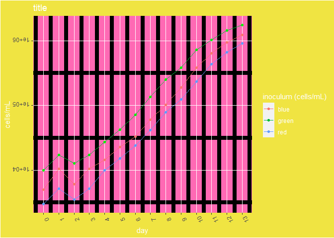

Hmk_BadPlot
================
Katelyn

Time to get funky.

## BAD PLOT

Let’s create a BAD PLOT of some *Synechococcus* sp. WH7803 growth
curves. There are three different growth curves from a range of starting
inoculum densities.

``` r
#calling the package tidyverse
library(tidyverse)

#importing our data
syn <- read.csv("hmkBP.csv")

#checking the data 
view(syn)

#get crazy 
ggplot(syn) +
  geom_point(aes(x = day, y = cells.mL, color = "red")) +
  geom_point(aes(x = day, y = cells.mL.1, color = "blue")) +
  geom_point(aes(x = day, y = cells.mL.2), color = "green") +
  geom_line(aes(x = day, y = cells.mL, color = "red")) +
  geom_line(aes(x = day, y = cells.mL.1, color = "blue")) +
  geom_line(aes(x = day, y = cells.mL.2, color = "green")) +
  scale_y_continuous(trans='log10') +
  scale_x_continuous(breaks = seq(0, 13, 1)) +
  xlab("day") +  ylab("cells/mL") +
  ggtitle("title") + 
  labs(colour="inoculum (cells/mL)") +
  theme(axis.text.x = element_text(angle = 112), axis.text.y = element_text(angle = 180)) +
  theme(panel.grid.minor = element_line(size = 3, color = "black")) +
  theme(panel.background = element_rect(fill = 'hotpink')) +
  theme(plot.background = element_rect(fill = "#F0E442")) +
  theme(legend.background = element_rect(fill = "#F0E442")) +
  theme(text = element_text(color = "white"))
```



## WHY is this so terrible?

1.  Figures should encourage the eye to compare different data (Tufty,
    Principles of Graphical Excellence, pg 61-63). This graph has so
    many contrasting colors, its hard for the eye to go directly to the
    data.

2.  Eliminate as much non-data as possible, data to ink ratio should
    favor data (Tufty, Principles of Graphical Excellence, pg 91-92).
    The focus on grid-lines and background fill colors obviously break
    this rule.

3.  Make labeling left to right so its easier to for the eye to read
    (Tufty, Principles of Graphical Excellence, pg 186). Both the X and
    Y axis have their labels rotated.

4.  Ensure the graphs don’t distort, hide, or manipulate the data
    (Tufty, Principles of Graphical Excellence, pg 54). The data is
    clearly hidden in the heavily edited panel background and thick
    grid-lines, additionally the background is very close in color to
    one of the sample lines.

5.  Tell the truth about the data. (Tufty, Principles of Graphical
    Excellence, pg 53). The legend does not list the actual starting
    densities of each culture. Additionally, the legend has the colors
    indicated wrong.

6.  Use color as a tool to distinguish (Fundamentals of Data Vis, Wilke,
    ch 4.1). The legend, title, and axis titles are all white against a
    yellow background making it difficult to distinguish between them.
